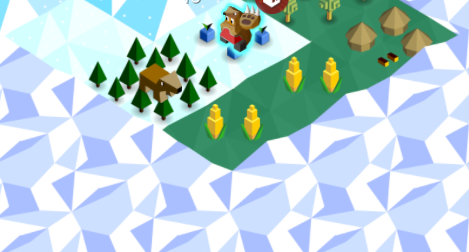

# Polytopia Village Odds Calculator

A calculator to find the odds of a village being in tiles of fog adjacent to a set of known terrain/resource tiles

## How it works

The user has to input a tribe, string of resources and then the shape in which the resources are aligned. 

The syntax for the tribe is the first letter of the tribe ("Ai" for Aimo and "Aq for Aquarion), it is case-insensitive. 

The syntax for the resource input is the resource in shortform separated by a comma, it is case-insensitive. 

Ex: "gf, fo, fo, ff, fo"

- **EF**: Empty Field
- **FF**: Fruit/Field
- **CF**: Crop/Field
- **FO**: Forest
- **GF**: Game/Forest
- **MO**: Mountain
- **MM**: Metal/Mountain

The shape string inputted by the user contains integers, "L", "R", or a combination of these characters. The starting direction is forwards and will go in that direction until there is an "L" or an "R" to change the direction. 

The tiles on the left the shape entered are considered to be fog and the ones on the right are visible territory. The table below is an example of what the shape gets processed into. 

fog fog fog fog fog 

fog fog xxx xxx xxx

fog fog xxx ter ter

fog fog xxx ter ter

As an example, to study the area of land in this picture, you need to start on the village because the fog has to be on the "left". 

So in this case, from the point of view of the village tile, the shape is 3 tiles forwards and then 2 tiles right. 

Therefore, the result of this input is "3R2". 

Note that the "L" and "R" are case-insensitive. 

Finally, the player specifies what tile they want to analyze, as in where they would hypothetically want to move their warrior.

## Development roadmap 

- Clean the code up
- Make the program take the player's tech into account (the player cannot see crops if they do not have organization nor can they see metal if they lack climbing).
- Add village odds because they are not yet considered as a legitimate tile
- Give the user the choice to change between multiple tribes. 
- Take not just the border into account but also the tiles that are two tiles away
- Work on an image recognizing system that reads the board from an image and outputs the best tile to go from there

## Issues with the program

The biggest and hardest issue with this tool is its lack of compatibility with water tiles. As their generation is very hard to put into an algorithm and the community does not know how to predict them yet, it is currently difficult to implement fish resources into the calculator. 

The other big problem is the usability of the program. It is a python file that mobile users are bound to have a hard time using. Maybe it might be able to get implemented into a discord bot one day?

## Licensing 

This repository follows the DO WHAT THE FUCK YOU WANT TO PUBLIC LICENSE

            DO WHAT THE FUCK YOU WANT TO PUBLIC LICENSE
                    Version 2, December 2004

 Copyright (C) 2004 Riley Ventura <riley.ventura@tutanota.com>

 Everyone is permitted to copy and distribute verbatim or modified
 copies of this license document, and changing it is allowed as long
 as the name is changed.

            DO WHAT THE FUCK YOU WANT TO PUBLIC LICENSE
   TERMS AND CONDITIONS FOR COPYING, DISTRIBUTION AND MODIFICATION

  0. You just DO WHAT THE FUCK YOU WANT TO.

